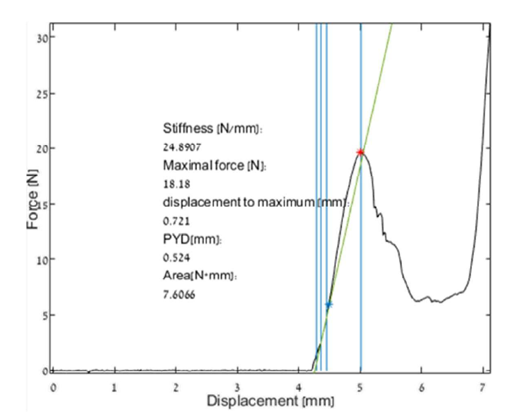
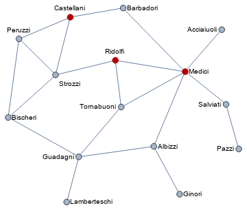
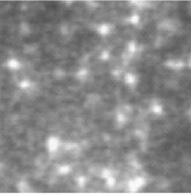
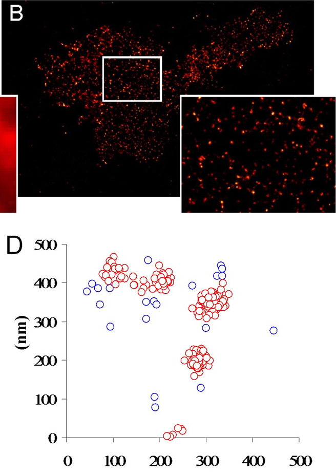

# Hackathon 2020 Projects Description

The goal of this document is to provide you with enough details to choose a project for our end-of-semester hackathon event. Once you decide on your favorite projects head over __[here](http://polljunkie.com/poll/wbbosy/sagol-hackathon-project-ranking)__ and rank them. All students should rank their preferences, even those who informed me that they couldn't attend. If you'd like to be teamed up with someone please let me know in the "Comments" section of this poll.

## General Information

The event will take place during the week of 22-29.7 We will have a starting Zoom session on 22.7 at 9:00 that will provide with a few extra details and general guidance for the event, and then you'll be off on your way. We will not have a closing session together.

Before that week you'll each be assigned to a project based on your preferences; the number of students per project varies. This group of students will have a zoom meeting with their mentor, i.e. the person who can describe best the goals of that specific project, a few weeks before the start of the event. That meeting should provide you with all the details you need to start working. including assigning each student to a specific goal of the project.

Each group will also have a Slack workspace as a place to discuss things, raise questions to their mentor, and monitor the general progress of the project. To join the Slack workspace click __[here](https://join.slack.com/t/sagolhackathon2020/shared_invite/zt-eavpry39-0AI5F0zQ5CyKHraVXFA48g).__ You probably also want to download their app if you don't have it already. This workspace will only be relevent after the groups were set and the mentors were met.

After the week is done, each group should have a git repo with the final, working version of their app. This repo should be accompanied by an exhaustive README document which gives the overarching view of the project. The project should also have documentation that is clear, readable and can help the mentor use the app on their own device easily. Information on the technical side of these requirements can be found the course's notebooks.

### Grading

50% - Code quality - proper code structure, usage of libraries, tests, git, PyPI.

30% - Team collaboration and documentation of the code.

20% - Does it work?

## Project 1: Wake/Sleep State Assessment
### Mentor: Dr. Anan Moran

This project's goal is to find wake and sleep states in rats from electrophysiological data by using machine-learning based tools. The provided data comes from Anan's rats, which were implanted with electrodes that recorded extracellular activity for 24 hours. The data is huge (several TBs), so a large part of the project is using libraries which allow processing of out-of-memory arrays. The data will have to be filtered using basic signal analysis techniques, and then fed into some classifier (probably a type of a Support Vector Machine) which will (hopefully) learn to identify the different arousal states from the labeled data Anan will also provide.

#### Number of students per project: 2-3
#### Relevant libraries: `scikit-learn`, `dask`, `scipy`

## Project 2: Biomechanical Testing Analysis
### Mentor: Prof. Yankel Gabet

In this project you will analyze data generated from biomechanical testing experiments done in the mentor's lab. Students will have to plot the measured data and in phase one should let the users mark a few key areas on that curve, as well as choose the current experiment type. After the user marks these areas the application will calculate a few key parameters of that stress-strain curve and save them to disk in an appropriate format. In a later phase you'll try to automate the detection process of different areas so that it could run automatically, with minimal input from the user.

#### Number of students per project: 2
#### Relevant libraries: `pandas`, `seaborn`, `scipy`

## Project 3: Better Feedback for Neurofeedback
### Mentor: Prof. Tamar Bar Shalita, Gil Issaschar

Prof. Bar Shalita's lab developed an EEG-based neurofeedback app which may help treated subjects with a variety of disorders. The system analyzes the EEG data in real time and shows the subjects a task that they should complete by modulating their own EEG signal. The way the system shows the subjects whether they're improving or not is by having them attempt inserting a ball into a rectangle on a computer screen in front of them. The lab would like to improve and extend the different visual and auditory outputs of the system, so that they could possibly test and find the best type of visual signal in neurofeedback-based tasks. Thus, the two main goals here are to create a robust interface to the existing system which outputs the data, analyze this data in real time and finally create and update the proper visual and auditory cue as the data flows.

#### Number of students per project: 2-3
#### Relevant libraries: `scikit-image`, `numpy`, `matplotlib`

## Project 4: Graphical Epidemic Simulation
### Mentor: Hagai Har-Gil

This project has no direct impact on some existing research; rather it's an exercise in simulating an epidemic with a SIR-type model. SIR stands for _susceptible_, i.e. haven't been infected, _infectious_ and _removed_. Each agent is in one of these three phases, and your goal is to move them randomly through their neighborhood and see how the disease spreads. The parameters of the epidemic - how infectious is it, what is the maximal radius for infection and so on - should be user controllable, which will help us understand the significance of some of the more obscure parameters of this disease. You should show both the way each agent moves on the grid (points on a canvas) and some metrics for the number of infections, infection rate and so on. The idea is to re-create some parts of the fantastic ThreeBlueOneBrown video linked [here](https://www.youtube.com/watch?v=gxAaO2rsdIs), although our visualizations will be a bit simpler.

#### Number of students per project: 2-3
#### Relevant libraries: `bokeh`, `numpy`

## Project 5: Graph-based Epidemic Spread
### Mentor: Dr. Pablo Blinder

The graph-based approached to studying disease spread uses graphs, composed of edges and nodes, to build a somewhat 'fixed' model of the population and their interaction:

Each agent can be infected, susceptible or removed, and the idea is to build real-life looking graphs with many nodes (i.e. people) and see how the disease spreads throughout it, while controlling some of its parameters. The graph will be a "small world" graph, which can be generated easily with Python's graph libraries, and many of the possible questions this model can answer were shown [here](https://community.wolfram.com/groups/-/m/t/1907703), although this text is obviously way beyond what you're expected to do. Your goal will be to explore these types of questions and visualize the spread of the epidemic.

#### Number of students per project: 2
#### Relevant libraries: `networkx`, `graphviz`, `seaborn`

## Project 6: Membrane Detection and Analysis
### Mentor: Mirna Safieh, Lab of Prof. Daniel Michaelson

The project revolves around a computational pipeline which is aimed at detecting and analyzing images of neurons and their membranes taken by a confocal microscope. The research question requires us to detect the outer membrane of each neuron, and to analyze the amount of fluorescence coming from that area following immunohistochemical staining which was done in the lab. The data will be analyzed statistically for a number of parameters. The other part of the project, the one not dealing with image analysis, deals with the construction of an effective computational pipeline that can efficiently process many images in parallel.

#### Number of students per project: 2
#### Relevant Libraries: `pandas`, `scikit-image`, `dask`

## Project 7: Tracking Fluorescent Images
### Mentor: Mirna Safieh, Lab of Prof. Daniel Michaelson

Our goal is to track a single protein, ABCA-1, as it moves around in the membrane of HeLa cells. The raw data is composed of a timelapse of images taken from a TIRF microscope (seen below). After loading the data, the main goal would be to reliably track each particle in the image as it moves through the field of view. Once the tracking is set you'll measure the fluorescence of that particle over time, and possibly compare the mobility of the particles and segment them into two distinct groups.

#### Number of students per project: 2
#### Relevant libraries: `scikit-image`, `opencv`, `matplotlib`

## Project 8: Distance-based Clustering
### Mentor: Prof. Uri Ashery

This project's goal is to analyze clusters of particles which were images using the dSTORM method, as seen in the attached image. A specific method of analysis that detects these clusters already exists, but it's unusable in its current state, so the goal is to reproduce previous results which were made with the same algorithm, but make it easier to use and more efficient. A GUI will also be used to let the user input the clustering parameters and see how well they do.

#### Number of students per project: 2-3
#### Relevant libraries: `scikit-image`, `PySimpleGUI`, `seaborn`, `pandas`

## Project 9: Eye Tracker Data Analysis
### Mentor: Chelsea Gober, Lab of Prof. Yair Bar-Haim

This project analyzes data from an eye tracker to see whether a novel approach can prevent post-traumatic stress symptoms. The general idea is to "prepare" the subjects for intrusive stimuli so that when they actually occur these subjects will be less susceptible to trauma. To do that, subjects undergo experiments with an eye tracker which measures their response to aversive visual stimuli, and the analysis of gazing patterns may reveal whether the novel treatment did indeed reduce subject's deterrence from the stimuli.

#### Number of students per project: 2
#### Relevant libraries: `pandas`, `seaborn`

## Project 10: FMRI Pipeline
### Mentor: Zvi Baratz, Lab of Prof. Yaniv Assaf

FSL is an important fMRI toolkit, and `nipype` is a Python package offering a Pythonic interface to FSL and other such toolkits. FSL offers a few pre-built pipeline for analysis, one of which is `fsl_anat` which offers an easy-to-use pre-processing pipeline for anatomical data. Unfortunately `nipype` doesn't offer an API to this script, albeit it's possible to manually construct it from functions it does offer. This project will re-create `fsl_anat` using native `nipype` "Workflows", and possibly even contribute it back to `nipype` itself, to be used by the wider scientific community.

#### Number of students per project: 2-3
#### Relevant libraries: `nipype`

## Project 11: Microorganism Effects Analysis
### Mentor: Efrat Kohen, Prof. Hadas Mamane and Prof. Yuval Shavitt

The Shafdan, the largest wastewater treatment facility in Israel, would like to incorporate novel data analysis tools for its data. Everyday it measures the concentration of many different microorganisms in the wastewater, and it also has data which is a proxy of the quality of the water it purified. The goal is to develop a model that can correlate a specific concentration of one or more microorganisms which always results in better wastewater quality. This model can be based on either classical statistical methods or on more modern approaches.

#### Number of students per project: 2-3
#### Relevant libraries: `pandas`, `scikit-learn`, `seaborn`, `statsmodels`
